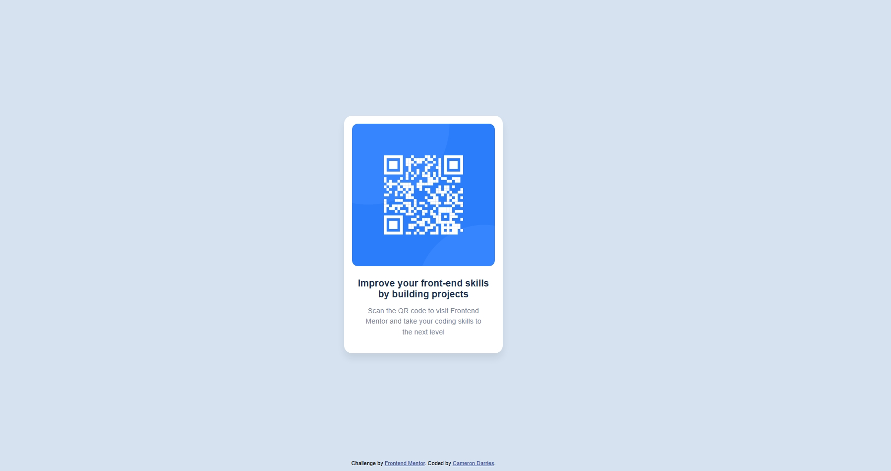

# Frontend Mentor – QR Code Component Solution

This repository contains my solution to the **QR Code Component** challenge from [Frontend Mentor](https://www.frontendmentor.io/).  
The goal of this project was to build a clean, responsive UI component using only **HTML and CSS**, closely matching the provided mobile and desktop designs.

This challenge helped reinforce my understanding of layout, spacing, and responsive design fundamentals.

---

## 📌 Overview

The QR Code Component is a simple, centered card layout featuring:
- A QR code image
- A heading and supporting text
- A responsive layout that works seamlessly on both mobile and desktop screens

The project focuses on **visual accuracy**, **CSS layout techniques**, and **mobile-first design principles**.

---

### 📸 Screenshot

---

### 🔗 Links

- **Solution URL:** https://www.frontendmentor.io/solutions/qr-code-component-html-css-XXXX  
- **Live Site URL:** https://your-live-site-url.com

_(Replace the links above once deployed.)_

---

## ⚙️ My Process

### 🛠 Built With

- Semantic HTML5
- CSS (Flexbox)
- Mobile-first workflow
- Responsive design principles
- Custom CSS properties
- Google Fonts (Outfit)

---

### 📚 What I Learned

While working on this project, I strengthened my understanding of:

- Centering content both vertically and horizontally using Flexbox
- Constraining layouts using `max-width` instead of fixed widths
- Building components that remain visually consistent across screen sizes
- Writing cleaner, more maintainable CSS
- Matching designs closely to provided UI mockups

This challenge also reinforced the importance of **keeping components simple and focused**, especially when working without JavaScript.

---

### 🚀 Continued Development

In future projects, I want to continue improving on:

- Writing more scalable and reusable CSS
- Using `rem` units consistently for better accessibility
- Applying BEM or utility-based naming conventions
- Exploring CSS Grid for more complex layouts
- Improving visual polish with subtle animations and transitions

---

### 📖 Useful Resources

- [Frontend Mentor](https://www.frontendmentor.io/) – For realistic front-end challenges
- [CSS Flexbox Guide – MDN](https://developer.mozilla.org/en-US/docs/Web/CSS/CSS_Flexible_Box_Layout) – Helped reinforce layout fundamentals
- [Kevin Powell – YouTube](https://www.youtube.com/@KevinPowell) – Excellent explanations of modern CSS techniques

---

## 👤 Author

- **Name:** Cameron Darries  
- **Frontend Mentor:** https://www.frontendmentor.io/profile/CameronDarries  

---

## 🙏 Acknowledgments

Thanks to **Frontend Mentor** for providing well-designed challenges that encourage hands-on learning and best practices in front-end development.

